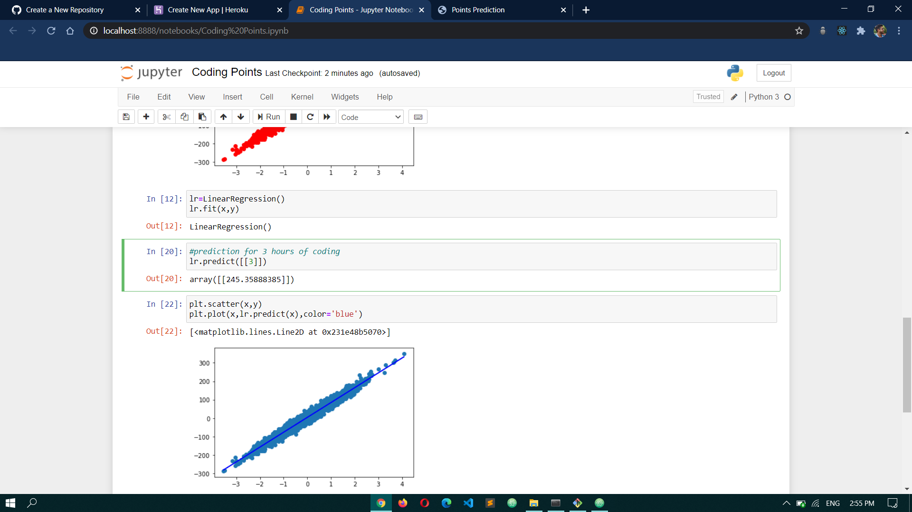
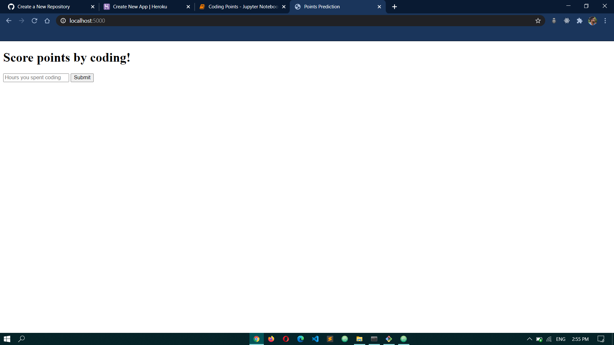
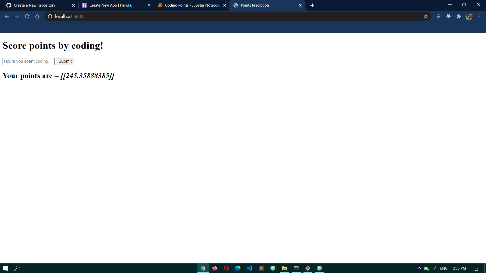

# Score-points-by-coding
In this challenge, you are given walkatime data of some students and how they performed in the evaluation exam. Your task is to predict the score you will get given the amount of time you spend on coding daily.

<b>Input</b>: You are given one feature corresponding to time noted by walkatime.

<b>Output</b>: A scalar denoting the level of perfomance student achived by devoting the given time.

## Model:
</img>

## Input:
</img>

## Output:
</img>
